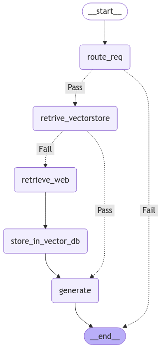

# MegaSchool_ITMO_task
Задание для Мегашколы ITMO трек ИИ

### Прошу прочитать

- Задание на клауд загрузить не удалось по причине того что билинг лег у яндекса, тупо не смог оплатить а альтернативы искать время было уже на исходе

1) Сервис полностью асинхронный, все запросы у меня удалось стресс тестом проверить
1 минута по 20 юзеров в 5 секунд все устояло отлично
100 запросов выполняются меньше минуты

2) Докер сервис поднимается и настроен, в него стрестест и стучаться можно

3) Если необходимо могу сделать демо локльно или отослать видеозапись

# Схема Агента

# О проекте 

- Retriver - Openai
- LLM - Openai gpt-4o
- searchAPI - Yandex

Основной стек: Langchain + Langgraph

Особености:
- Реализован RAG, что способствует экономии средств поисковика. Нет необходимости повторно искать ответы в интернете, эмбенденги с уже единожды отработынными ответами храняться локально в FAISS

- Поиск в интернете сделан через grpc

- Полностью асинхронная обработка запросов

- Примерная скорость 1 запроса: 5 сек - Поиск api;  3 сек - RAG

# Запуск
- Для начала создать переменные окружения
создайте файл .env с строками
OPENAI_API_KEY=your-openai-api-key
OPENAI_PROXY=your-yandex-api-key
YANDEX_API=your-grpc-host

Можно не использовать Proxy, а запросы делать через vpn

### Напишите мне я дам ключи или скину .env
tg: @PianiyMaster

1) Через Docer
- Проверить правильность заполнения .env и положить ее в корневой репозиторий
- docker-compose up -d или docker compose up -d если новая версия
- После сборки решение доступно на http://0.0.0.0:8000

2) Лоакльно  .venv
Необходимо установить PY3.12.7 и добавить ее переменную в PATH

- chmod +x run.sh  # Делаем скрипт исполняемым
- ./run.sh         # Запускаем сервер FastAPI
Сервер Запущен!